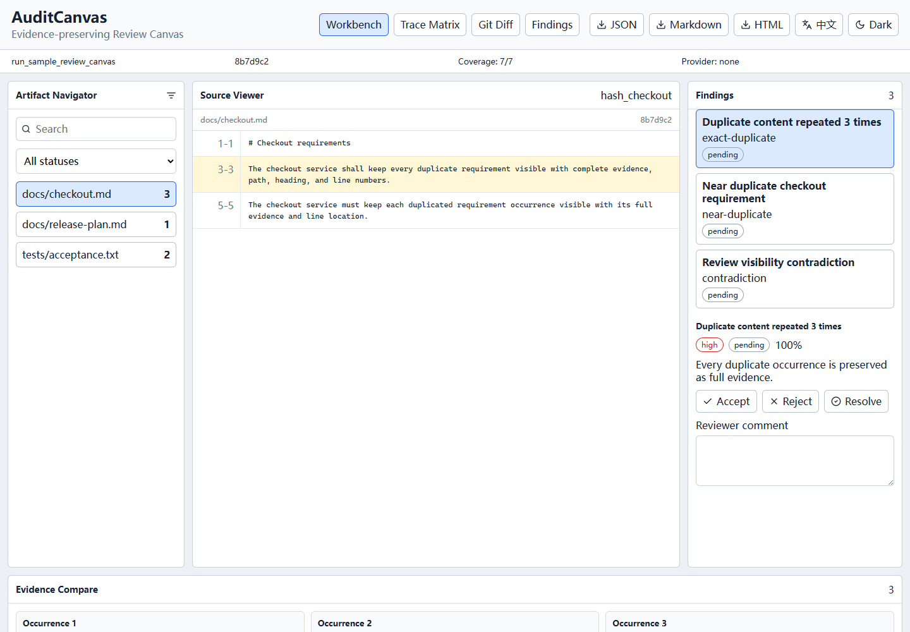

# AuditCanvas

[简体中文](README.md) | English

AuditCanvas is a local-first, Git-aware audit workbench for software artifacts. It preserves full evidence, tracks coverage, and can optionally use AI providers without making them required.

An independent open-source project with an optional Codex plugin.



## What It Solves

- AI audits often hide repeated content through summaries.
- Reviewers cannot confirm whether every source block was checked.
- Findings often lose stable links back to original text, path, heading, line number, commit, and file hash.
- Requirements, code, tests, and Git baselines are usually reviewed in separate tools.
- Long AI conversations lose project baseline decisions.

AuditCanvas keeps every duplicate occurrence expanded by default. It does not use AI unless you explicitly configure a provider. Data stays local by default.

## 3 Minute Quick Start

```powershell
git clone https://github.com/duiliang/audit-canvas.git
cd audit-canvas
pnpm install
pnpm build
node packages/cli/dist/index.js scan examples/sample-project
node packages/cli/dist/index.js export --format html
node packages/cli/dist/index.js serve --port 4738
```

Open `http://127.0.0.1:4738`. This page loads the real audit run created above; only GitHub Pages uses the explicitly labelled sample-data mode.

Version `0.1.0` is distributed through GitHub source, Releases, and the Codex marketplace. The workspace packages are intentionally private and are not published to npm yet.

## CLI

```powershell
node packages/cli/dist/index.js scan .
node packages/cli/dist/index.js scan docs/
node packages/cli/dist/index.js scan . --baseline HEAD~1
node packages/cli/dist/index.js scan . --baseline main --target HEAD
node packages/cli/dist/index.js export --format html
node packages/cli/dist/index.js export --format json
node packages/cli/dist/index.js verify-coverage
node packages/cli/dist/index.js doctor
```

CLI help and Markdown/HTML reports default to Chinese. Set `AUDIT_CANVAS_LOCALE=en`, or pass `--locale en` to `scan`, `export`, or `serve` for English. JSON protocol data is never translated.

CLI output is written to `.auditcanvas/`:

```text
.auditcanvas/
  config.json
  runs/
  reports/
  reviews/
  cache/
```

`.auditcanvas/cache/` is ignored by Git.

## Web

```powershell
pnpm --filter @audit-canvas/web dev
pnpm --filter @audit-canvas/web build
```

The Web Review Canvas includes:

- Artifact Navigator
- Source Viewer with line ranges and evidence highlighting
- Finding Panel with accept, reject, resolve, and reviewer comment state
- Evidence Compare with every occurrence expanded
- Trace Matrix
- Git Diff
- Finding List
- JSON, Markdown, and HTML export
- dark mode
- Chinese and English UI toggle

## Codex Plugin

Install from the GitHub marketplace:

```powershell
codex plugin marketplace add duiliang/audit-canvas
codex plugin add codex-audit-canvas@audit-canvas
```

Local plugin source:

```text
plugins/codex-audit-canvas
```

The published plugin includes a standalone CLI bundle and always writes audit output to the repository where Codex invokes it. Set `AUDIT_CANVAS_WORKSPACE` only when the launcher cannot set its working directory.

Plugin workflows:

- `audit-artifacts`
- `compare-baselines`
- `resolve-findings`

Uninstall or upgrade with Codex plugin commands:

```powershell
codex plugin remove codex-audit-canvas
codex plugin add codex-audit-canvas@audit-canvas
```

## AI Providers

Remote providers are disabled by default. The deterministic local audit runs without any model.

Provider adapters included:

- Mock provider for tests
- OpenAI-compatible provider
- Ollama provider

API keys must come from environment variables or a future secure system store. They must not be committed, exported, logged, or rendered in the Web UI.

## Quality Gate

```powershell
pnpm lint
pnpm typecheck
pnpm test
pnpm test:coverage
pnpm build
pnpm test:e2e
pnpm validate:plugin
pnpm validate:marketplace
pnpm validate:release
```

## Project Structure

```text
apps/web
packages/schema
packages/core
packages/git
packages/providers
packages/cli
packages/ui
plugins/codex-audit-canvas
examples
docs
```

## License

MIT. See [LICENSE](LICENSE).
